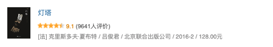

    
豆瓣链接 

##
[
豆瓣读书
](https://book.douban.com/subject/26695174/) 
 
---

##

***Score：***★★★★☆

***Date：Sat,Jan 30,2021***

# 《灯塔》
***
Written by xunux
***

&emsp;&emsp;你能想像一个人从出生之后就一直待在海中一座孤岛上的灯塔里并一直待五十年虽然每周都会有船送来食物补给但他的日常活动除了钓鱼就是让一本旧词典随意摊开在哪一页闭上眼睛用手指着某处指到哪个词就开始想像实物直到最后遇到一个形而上的词而放弃这种活动吗？
但他是那么温柔的一个人，因为桌边养着一条鱼，所以会在用餐时用书将鱼的视线挡住不让它看到自己被制熟的同类；但也是那么胆小的一个人，每当送货的或者其他人上岸，都只会躲起来偷偷观察，等到人离开了才重新出现；但也是那么渴望认识世界的一个人，所以会收集漂到岸边来的每样物品，即使是树叶也好好保存着。

&emsp;&emsp;幸运的是，新来的给他送货的人因为蹲过监狱，所以比其他人更知道被困在一个地方得不到自由对一个人意味着什么。所以才会在某次送货时附带一张小纸条，“你喜欢什么？”，得到“世界的景象”的回答之后下一次送来世界万事万物的照片。

&emsp;&emsp;在下一次，当他在词典上指到prison这个词时，立刻联想到了自己的处境，在后续的释义中读到只有罪犯才会蹲监狱时，他眼前的世界崩塌了。所以他要把养的鱼放回大海，要把旧词典丢向大海。

&emsp;&emsp;当他拿着一截绳子，你以为他要上吊自杀，其实他只是为了绑他的箱子，因为他要随着轮船下一次的到达，而永远离开这里，开启他此后新的人生了。

##
 本作品采用<a rel="license" href="http://creativecommons.org/licenses/by-nc-nd/3.0/cn/">知识共享署名-非商业性使用-禁止演绎 3.0 中国大陆许可协议</a>进行许可。

