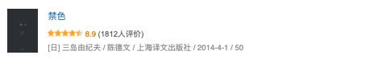

    
豆瓣链接 

##
[
豆瓣读书
](https://book.douban.com/subject/25839615/) 
 
---

##

***Score：***★★★★☆

***Date：Sat,Feb 27,2021***

# 《禁色》
***
Written by xunux
***

&emsp;&emsp;桧俊辅，已年迈的著名作家，丑陋的容貌贯穿其一生，有过三任妻子，不是欺骗他就是抛弃他。夏日的一次度假，让他偶然邂逅了青春靓丽的男青年南悠一。在听完悠一诉说家庭的困难之后，借（或者说送）给他五十万日元，条件是让悠一成为自己的棋子，向那些伤害过自己的女子，抑或他厌恶的整个女性群体，施加报复。

&emsp;&emsp;桧俊辅对悠一这么自信，是因为悠一的相貌实在是太美了，他有百分百的把握让每一位女性目标，即使是有夫之妇，都爱上这位美青年。同时，又可以保证悠一不会爱上任何一位女性，因为他是同性恋。

&emsp;&emsp;沦陷的女性有三位，康子，穗高恭子和镝木夫人。

&emsp;&emsp;康子的父母与悠一已逝的父亲本就有来往，很小的时候就订了娃娃亲。悠一父亲去世后，家境变得不好。母亲身体也不好，就盼望着悠一能早日结婚生子。为了孝顺母亲，只能迎娶康子，正是桧俊辅张罗了这桩婚事，使悠一在金钱方面不必忧愁。

&emsp;&emsp;但是悠一终究是不爱康子的，即使康子深爱着他。但婚后的生活让康子知道，悠一是不爱她的，即使他让她怀孕，又在生产的时候陪着她。但在日常生活的冷漠之中，康子只能渐渐筑起高墙，把自己保护在内，使自己的内心不受伤害。直到发生了一件事，撞破了悠一的秘密，康子从高墙内被拖拽出来，终于对悠一达到了彻底的冷漠。

&emsp;&emsp;镝木夫人，原伯爵镝木信孝的妻子，生性风流，有把握让任何男人爱上她，直到遇见悠一，从而变得彻底的不自信，到最后发展为她知道悠一不爱她，她也会继续爱着悠一，并且默默地守护他。

&emsp;&emsp;穗高恭子，虽然也被悠一吸引，但因为对自己有绝对的信心，觉得自己对悠一也只不过是随便玩玩，呼之即来挥之即去的那种。最后被悠一欺骗，和以为是悠一但其实是俊辅上了床，从此彻底在风流场上销声匿迹。

&emsp;&emsp;悠一的性倾向，没有得到俊辅的反对，因此顺利地进入了同性恋的圈子。在圈子中除了那些发生短暂肉体关系的阿猫阿狗，交往较久的有两位，镝木信孝（没错，镝木夫人当了同妻）和河田先生，两位都是样貌丑陋的中年男人。

&emsp;&emsp;镝木信孝也是爱得卑微，为了能和悠一上床，使劲夸赞悠一的美貌，使悠一沉浸在被赞美的愉悦中，从而委身于他。当他和悠一的性事被镝木夫人撞见之后，悠一要与其分手，为了挽留悠一甚至愿意跪下来亲吻悠一的鞋子，但最终难逃被抛弃。滑稽的是，因为共同持有对悠一的爱意，竟然使他和镝木夫人的婚姻能够一直持续。

&emsp;&emsp;河田先生倒是懂得及时停止，知道自己对悠一的热情终有消散的一天，所以即使万般不愿，也要在热情的鼎盛期与悠一断绝关系。

&emsp;&emsp;最后说回桧俊辅，是他从茫茫人海中觅得了悠一这位拥有天神下凡般的美貌与肌体的人间尤物。悠一究竟有多美？与同性恋酒吧的某一位有一夜情之后，那位第二天就要剃光头发以示纪念；与学校（悠一还在上大学）的一位同学在白天寻找快乐之后，那位同学倚在怀里都要因为感激之情而幸福得掉眼泪。悠一拥有俊辅曾经拥有现已消逝或者从未拥有的东西：青春与美貌，凭这两样就能让俊辅对悠一进行神化，认为悠一就是美的极致，以致到后来发现自己已不知不觉间也爱上了这位美青年，只不过爱得很隐晦，也就只是在死后把所有加起来差不多一千万日元的遗产全数遗赠给悠一罢了。

&emsp;&emsp;因为懂得，所以想占有。桧俊辅凭借着最开始的人情，还能让悠一听从于自己，去实施他的报复大计。可是在这人世走一遭，悠一还是拥有了自己的意志，他想要绝对的自由。俊辅由此知道，悠一变了，已经偏离了他所赋予的那种绝对的美的想像。悠一可以去主动斩断一切情缘了，所以俊辅才立了这种遗嘱，不仅欠下的五十万元还不上，还要让悠一永远地与他产生关系了。

&emsp;&emsp;虽然本书讨论的终极目标是美，但我在书中读到的更多是爱，各种各样的一厢情愿和爱而不得。也不禁让我思索，我们爱对方，究竟是爱对方的本身，还是爱在对方的身上，投射出的我们自己呢。

##
 本作品采用<a rel="license" href="http://creativecommons.org/licenses/by-nc-nd/3.0/cn/">知识共享署名-非商业性使用-禁止演绎 3.0 中国大陆许可协议</a>进行许可。